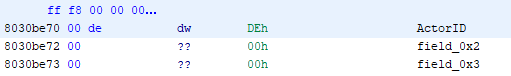
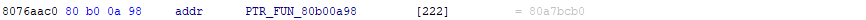

# Newer Super Mario Bros Wii Modding

custom edit of the Newer SMBW game mod, containing new enemies, levels, bosses and maybe worldmaps.
If we manage to figure out how the code injection with assembly files work, we will probably add a new powerup (maybe the shell of NSMB for the DS)
___
# Adding a new sprite into the game

- First create a .cpp file that goes in /src/ -> This file will contain all the code for the custom sprite. A basic structure would be:
```c++
#include <common.h>       //some common functions and useful stuff
#include <game.h>         //main game functions, most important file. Almost everything you use from NSMBW is located here
#include <g3dhax.h>       //Used for displaying 3d-models and updating graphics
#include <sfx.h>          //sound effects which can be played by this sprite (e.g. die-sound when Mario jumps on it)

//now the class itself -> dEn_c is the base class for sprites and NPCs
class daTestSprite: public dEn_c {
    //main functions:
    int onCreate();       //called when a new object of this sprite is created
    int onDelete();       //called when an object of this sprite is deleted
    int onExecute();      //loop. Called every frame after the sprite was created with onCreate()
    int onDraw();         //draws the sprite. Called every frame
    
    //this is necessary for allocating memory on the heap(RAM) for loading the actual 3D-Model
    mHeapAllocator_c allocator;
    
    //resources file which contains the 3d model and its animations. This is usually a .brres-file
    nw4r::g3d::ResFile resFile;
    //actual 3D-bodyModel contained in the .brres-file. This is a .mdl0-file
    m3d::mdl_c bodyModel;
    //actual animation, if the model has one. Contained in the .brres file and stored in a .chr0-file
    m3d::anmChr_c chrAnimation;
    
    //now here are basic variables and values. This depends on the actual type of sprite. Basic ones are
    int timer;
    float dying;
    char damage;
    char isDown;
    Vec initialPos;
    
    //now the actual hitbox used for the physics and collision
    ActivePhysics Physics;
    
    //now we add some functions
    //first, this one is static and creates a new object of this class
    static daTestSprite* build();
    
    //set a new animation
    void bindAnimChr_and_setUpdateRate(const char* name, int unk, float unk2, float rate);
    
    //update the Drawmatrix; used for drawing the 3d-model in the right "perspective"
    void updateModelMatrices();
    
    //check for collision with tiles like a wall -> sprite should maybe turn
    bool calculateTileCollisions();
    
    //now all the collision functions. Actually there are a lot, but the most common used ones are:
    void playerCollision(ActivePhysics* apThis, ActivePhysics* apOther);
    void spriteCollision(ActivePhysics* apThis, ActivePhysics* apOther);
    void yoshiCollision(ActivePhysics* apThis, ActivePhysics* apOther);
    
    //collision with Mario when he has a Star
    bool collisionCat3_StarPower(ActivePhysics *apThis, ActivePhysics *apOther);	
    //collision with sliding-Mario
    bool collisionCat5_Mario(ActivePhysics *apThis, ActivePhysics *apOther);
    //Player drills with Propeller
    bool collisionCatD_Drill(ActivePhysics *apThis, ActivePhysics *apOther);
    //Player punches fence behind
    bool collisionCat8_FencePunch(ActivePhysics *apThis, ActivePhysics *apOther);	
    //When Player ground pounds
    bool collisionCat7_GroundPound(ActivePhysics *apThis, ActivePhysics *apOther);
     //Player groundpounds with yoshi
    bool collisionCat7_GroundPoundYoshi(ActivePhysics *apThis, ActivePhysics *apOther);	
    //When Player slides with penguin suit
    bool collisionCatA_PenguinMario(ActivePhysics *apThis, ActivePhysics *apOther);	
    //When player is shot from pipe cannon
    bool collisionCat11_PipeCannon(ActivePhysics *apThis, ActivePhysics *apOther);
    //when object is thrown on Sprite (koopa-shell, barrel)
    bool collisionCat9_RollingObject(ActivePhysics *apThis, ActivePhysics *apOther);		
    //collision with fireball
    bool collisionCat1_Fireball_E_Explosion(ActivePhysics *apThis, ActivePhysics *apOther);
    //collides with iceball
    bool collisionCat2_IceBall_15_YoshiIce(ActivePhysics *apThis, ActivePhysics *apOther);		        
    //collides with hammer from the hammer-suit-powerup
    bool collisionCat13_Hammer(ActivePhysics *apThis, ActivePhysics *apOther);	
    //when collides with yosgi fire spit
    bool collisionCat14_YoshiFire(ActivePhysics *apThis, ActivePhysics *apOther);	                  
    
    //At last there are the states the sprite can be in. A sprite can be in only one state at a specific time
    //The states are coded seperately
    //if your sprite does not need multiple states (for example a star coin has just one state, 
    //which is rotating and not moving) yout won't need the following section
    
    //first make clear that this class can use states
    USING_STATES(daTestEnemy);
    
    //now declare all states you need for the sprite
    DECLARE_STATE(Walk);
    DECLARE_STATE(Turn);
    DECLARE_STATE(Jump);
    DECLARE_STATE(Die);
    
    //So that's basically everything, but now the methods have to be implemented, and this is the real coding part, yeah!
}
```
- now create a .yaml-file which goes into the root of Kamek and links to the cpp
```yaml
---
source_files: [../src/testSprite.cpp]
```
- add the following line in NewerProject.yaml and NewerProjectKP.yaml:
```yaml
- processed/testSprite.yaml
```

## Adding the sprite into NSMBW with hooks
The final step (and the most confusing one) is to basically tell the wii to load your new sprite. This is possible by replacing an existing sprite
with your new one. This has to be defined in the ```testSprite.yaml``` and it uses something called "Hooks". Hooks are type of structures which
help to patch data into the wii code. Even though there are four types of hooks, the most important one is ```add_func_pointer```. The other ones are 
called ```branch_insn```(changes instruction for a branch to custom assembly), ```nop_insn```(disables lines of code in NSMBW) and ```patch```(replace bytes manually), but those are used in specific cases and not detailed here (except for the ```patch``` later on).
But what is important is the ```add_func_pointer``` hook, which patches a function into the code at a specified address. You have to declare it below 
the linking to the cpp file in your ```.yaml```:
```yaml
---
source_files: [../src/testSprite.cpp]
hooks:
    - name: TestEnemyBuild
      type: add_func_pointer
      src_addr_pal: 0x80B00A98
      target_func: 'daTestEnemy::build()'
```
So, what are those parameters?

- name: The name of the hook. This can be anything, but should be something which explains the purpose of the hook
- type: This is the type of the hook. As metioned earlier, there are four types, but the most common used is ```add_func_pointer```
- src_addr_pal: Here is where things get complicated. This is the address of where to patch the function. Depends on which sprite to replace.
                This will be explained in detail in the next section
- target_func: This is the actual function the hook patches into the code. Should be the sprites ```build()``` function, which creates a new sprite-object

## Obtaining the src_addr_pal

Depending on which NSMBW sprite to replace, you have to set a different address in the hook. To get those address, you will have to perform some hex-arithmetic
but you'll also need the official NSMBW .elf executable, which I am not going to provide here. That file has to be opened in a disassembler like IDA or ghidra.

Let's assume we want to replace the unused sprite with id = 174. To obtain the ```src_addr_pal``` for this sprite, do the following steps:

- The sprites are stored in decimal order, so we have to convert it into its hexadecimal representation. ```174``` would be ```0xAE```
- perform the following arithmetic operation: ```0x8030A340 + (0x28 * SPRITE_ID_IN_HEX)```. The result is the number we need to search for in the .elf file.
  In case of our example ```0xAE``` the result would be ```0x8030BE70```
- now we have to look for that address in the executable file. It will tell us the actual actorID (which is NOT same as the spriteID):
  
  
  Right next to our number there is the value we are looking for, in our case ```0x00de```, which is the same as ```0xDE```

- perform the following arithmetic operation: ```0x8076A748 + (0x4 * ACTOR_ID_FROM_TABLE)```. The result is the new number we need to search for in the .elf file.
  In case of our example ```0xDE``` the result would be ```0x8076AAC0```
- now we have to look again for that address in the executable file. It will finally tell us our ```src_addr_pal```:
  
  
  So after the ```PTR_FUN``` there finally is our ```src_addr_pal```. In our case it's ```0x80B00A98```, which is in fact exactly the address from the above .yaml
  
## Using custom 3D-Models and Animations

When using custom 3D-Models for sprites, they have to be defined in another hook for NSMBW to find it. All new .arc files used by this sprite (they are in the 
object folder of NSMBW and contain .brres and animations) have to be named in a static list in C++ (usually at the beginning of the sprite's cpp file). For
the testSprite it maybe would look like this:
```c++
const char* TestSpritearcNameList [] = {
    "testSprite",       //first arc file to load for e.g. the model
    "ball",             //second arc file for e.g. a ball the sprites throws or other stuff
    NULL                //this is importatnand marks the end of the list
}
```
With this list the game is able to load all necessary files used by the sprite. But we have to connect this list of necessary files with the
actual sprites who use it, so we will have to add another ```add_func_pointer``` hook into the sprites ```.yaml``` and point to the list containing the resources. 
In our case the second hook added into the .yaml would be:
```yaml
  - name: ShyGuySpriteFileInfo
    type: add_func_pointer
    src_addr_pal: 0x8031AE04
    target_func: 'SGarcNameList'
```
The ```src_addr_pal``` is calculated with ```0x8031AB4C + SPRITEID_IN_HEX * 0x4```. So in our case it's ```0x8031AE04```(Sprite id ```174 = 0xAE```)

## Adjusting data by using the ```patch``` hook

This hook lets you replace custom bytes in the game. It can be used to change the values of an Entity such like the spawningoffset.
